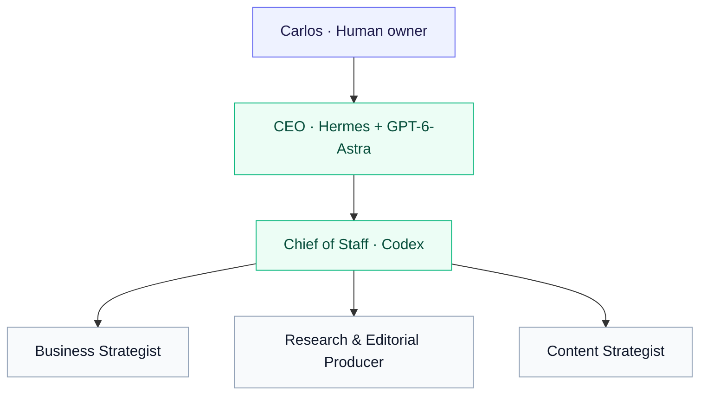

<div align="center">

# Space Exploration News

### An AI editorial team. Clear ownership. Human judgment.

Strategy, research, and review—coordinated through Paperclip,<br>
powered by Hermes and Codex, running on Amazon EC2.

**[Explore the work](#see-the-work) · [Meet the team](#how-the-team-works) · [Reproduce the setup](docs/hermes-setup.md)**

</div>

---

<table>
<tr>
<td align="center" width="25%"><a href="https://github.com/paperclipai/paperclip"></a><br><strong>Paperclip</strong><br>Orchestration &amp; accountability</td>
<td align="center" width="25%"><a href="https://hermes-agent.nousresearch.com/"></a><br><strong>Hermes Agent</strong><br>CEO runtime &amp; memory</td>
<td align="center" width="25%"><a href="https://developers.openai.com/codex/"></a><br><strong>Codex · GPT-6-Astra</strong><br>Subscription-backed reasoning</td>
<td align="center" width="25%"><a href="https://aws.amazon.com/ec2/"></a><br><strong>Amazon EC2</strong><br>Shared compute &amp; local services</td>
</tr>
</table>

## What this project demonstrates

A working headquarters for an AI-assisted editorial team: turn a goal into a specification, coordinate specialists, check the evidence, and bring a concrete draft back to a human reviewer.

| Explicit ownership | Evidence you can inspect | A reproducible operating setup |
| :--- | :--- | :--- |
| A CEO sets direction; the Chief of Staff coordinates specialists. | Source notes, QA corrections, specifications, and task checklists accompany the work. | Setup instructions, portable service templates, and SSH-only dashboard access are documented. |

This repository holds the team's operating documents and selected work products. Production websites and immersive applications belong in separate repositories. **Draft completion is not publication approval.** Carlos retains editorial, publishing, commercial, spend, and production decisions.

## How the team works



**Paperclip** assigns and tracks work. **Hermes** gives the CEO persistent memory and an interactive dashboard. **Codex** runs the existing team. **Agent OS** supplies standards and specifications.

Operational work flows through the Chief of Staff. Review gates and acceptance criteria keep the team focused on useful handoffs.

## See the work

Follow one editorial package from draft to review:

| 01 · Read | 02 · Inspect | 03 · Trace |
| :--- | :--- | :--- |
| [Mars review packet](docs/content/SPA-12-review.md) | [Independent QA corrections](docs/content/SPA-12-qa-report.md) | [Specification and task evidence](agent-os/specs/2026-09-05-0200-editorial-pilot/tasks.md) |
| A concrete sample of the editorial output. | What the review caught and why it mattered. | How scope, ownership, and completion were recorded. |

For the latest work, start with the **[progress tracker](agent-os/progress.md)** and **[recommendations index](recommendations/README.md)**. These include the direction toward math-and-code learning artifacts, Perseverance notebook work, and an Apollo interactive proposal; consult the dated task evidence for each item's status.

## Running on one EC2 host

| Service | Access | Role |
| :--- | :--- | :--- |
| Paperclip | `127.0.0.1:3100` | Tasks, agents, reporting lines, and execution history |
| Hermes dashboard | `127.0.0.1:9119` | Browser TUI, sessions, model settings, and memory |
| Hosted model inference | Codex subscription | GPT-6-Astra for the CEO; existing Codex models for the team |

**Verified September 5, 2026:** the Hermes CEO completed a Paperclip readiness run, and the dashboard's real chat terminal rendered Astra. Both services run under user systemd; the dashboard is enabled for startup. The host has **2 vCPUs / 3.7 GiB RAM**, with about **2.2 GiB available** after dashboard testing. This is an observed snapshot, not a concurrency benchmark or a reboot/restore test.

**[Setup & verification →](docs/hermes-setup.md)** · **[Infrastructure →](docs/infrastructure.md)** · **[Dashboard service template →](ops/systemd/hermes-dashboard.service.example)**

<details>
<summary><strong>Open browser chat through an SSH tunnel</strong></summary>

```bash
ssh -N -L 9119:127.0.0.1:9119 ec2-user@YOUR_EC2_HOST
```

Open **http://localhost:9119/chat** and keep the tunnel running. Use your normal SSH host and key options.

Start with the [CEO opening prompt](recommendations/prompts/hermes-ceo-opening.md). A dashboard chat shares the Hermes profile but does not automatically inherit a Paperclip run's API identity; the [runbook explains that boundary](docs/hermes-setup.md#dashboard-chat-versus-paperclip-identity).

</details>

## Find your starting point

| If you want to… | Start here |
| :--- | :--- |
| Understand the mission | [Vision](docs/vision.md) · [Roadmap](docs/roadmap.md) |
| See priorities and next actions | [Progress](agent-os/progress.md) · [Backlog](docs/backlog.md) |
| Understand the editorial process | [Content engine](docs/content-engine.md) · [Work product index](docs/content/README.md) |
| Reuse the CEO setup | [Hermes runbook](docs/hermes-setup.md) · [CEO instructions](ops/hermes/ceo-instructions.md) |
| Inspect operating standards | [Agent OS](agent-os/README.md) · [Headquarters rules](AGENTS.md) |
| Review evidence and limitations | [Current state](docs/current-state.md) · [Dated audit](docs/audit-2026-09-05.md) |
| Check the public repository boundary | [Security & secret exclusions](SECURITY.md) |

---

<sub>Public artifacts are reviewed examples. Credentials, private memory, databases, and raw runtime logs stay outside this repository. [Brand asset sources](docs/assets/brands/README.md); product names and marks belong to their respective owners and identify the technologies used.</sub>
